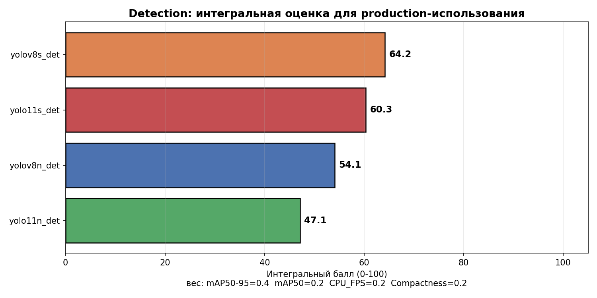

# 01. Пайплайн проекта

## 1. Постановка задачи

**Тема:** «Лёгкая система компьютерного зрения для контроля дефектов на конвейере».

### 1.1 Требования

1. Обнаружение и локализация дефектов пластиковых бутылок в реальном времени
2. Работа на обычном CPU без GPU (для дешёвого деплоя на производстве)
3. Поддержка нескольких бутылок в одном кадре
4. Подсчёт дефектов с дедупликацией (одна бутылка = одно событие)
5. Нативный UI для оператора линии

### 1.2 Выбор подхода — Object Detection

Object Detection (не classification) выбран потому что:
- В реальном кадре конвейера **несколько бутылок одновременно**
- Нужна **локализация** — точное место дефекта на корпусе
- Интеграция с ПЛК требует координат bbox для запуска сброса конкретной единицы

## 2. Датасет

Собственная разметка в Roboflow (workspace `nurlastdey/nurlastdey`).

| | |
|---|---|
| train | 1161 изображений |
| val | 204 изображений |
| Формат | YOLO (txt-аннотации, нормализованные координаты) |

### Классы (6)

| ID | Класс | Тип |
|---|---|---|
| 0 | deformed_bottl | Дефект формы |
| 1 | misaligned_label | Дефект этикетки |
| 2 | missing_cap | Дефект крышки |
| 3 | missing_label | Дефект этикетки |
| 4 | neck_deformed | Дефект формы |
| 5 | normal | Без дефектов |

## 3. Сравнительное исследование моделей

Сравнены 4 варианта YOLO для выбора оптимального backbone:

| Модель | Параметры | FLOPs | mAP@0.5 | mAP@0.5:0.95 | CPU FPS |
|---|---|---|---|---|---|
| yolov8n_det | 3.0 M | 8.1 G | 0.984 | 0.622 | 33.5 |
| **yolov8s_det** ★ | **11.2 M** | **28.6 G** | **0.991** | **0.703** | **18.5** |
| yolo11n_det | 2.6 M | 6.5 G | 0.979 | 0.610 | 29.8 |
| yolo11s_det | 9.4 M | 21.5 G | 0.988 | 0.692 | 20.1 |



**Вывод:** `yolov8s_det` — оптимальный баланс точности и ресурсов для промышленной инспекции.

Подробное обоснование, графики, методология: [02_detection_comparison.md](02_detection_comparison.md).

### 3.1 Критерии выбора

| Критерий | Вес | Почему важен |
|---|---|---|
| mAP@0.5:0.95 | 40% | Качество локализации — ключ для контроля качества |
| mAP@0.5 | 20% | Обнаружение факта наличия дефекта |
| CPU FPS | 20% | Возможность деплоя без GPU |
| Compactness | 20% | Размер для edge-устройств |

### 3.2 Почему именно s, а не n или m

- **n** — слишком слаб на строгой метрике (−8 п.п. mAP@0.5:0.95)
- **s** — оптимум: +точность без критичной потери скорости (всё ещё 6× запас над конвейером)
- **m и выше** — избыточны для 6 классов крупных объектов

## 4. Обучение

### 4.1 Гиперпараметры

Единые для всех вариантов (для честного сравнения):

| Параметр | Значение |
|---|---|
| epochs | 100 |
| imgsz | 640 |
| batch | 32 |
| optimizer | AdamW |
| lr0 | 0.001 |
| patience | 20 |
| seed | 42 |

### 4.2 Оборудование

NVIDIA RTX 5080 Laptop GPU (16 GB VRAM), CUDA 13, PyTorch 2.9.

Время обучения одной модели: ~9 минут.

### 4.3 Встреченные проблемы

**Ошибка libnvrtc-builtins.so.13.0** — решена через `LD_LIBRARY_PATH`:
```bash
LD=~/miniconda3/envs/ai/lib/python3.11/site-packages/nvidia/cu13/lib
LD_LIBRARY_PATH=$LD python scripts/train.py --data ...
```

**Placeholder класс-имена** в первом запуске — обновлены внутри `.pt` через `torch.save` после обучения.

Полные логи: [logs/train_det.log](logs/train_det.log) (crash), [logs/train_det2.log](logs/train_det2.log) (успех).

Детали обучения yolov8n_det: [03_detection_training.md](03_detection_training.md).

## 5. Деплой и inference-система

### 5.1 Архитектура приложения

**Технология:** PySide6 (Qt для Python) — нативное десктоп-приложение, не web.

```
┌─────────────────────────────────────────────────────┐
│              MainWindow (PySide6)                  │
│  ┌──────────┬────────────────┬────────────────┐   │
│  │ Controls │  Video Display │   Statistics   │   │
│  │  Model   │                │   counts/      │   │
│  │  Mode    │  60 FPS UI     │   defect %     │   │
│  │  Conf    │                │                │   │
│  └──────────┴────────────────┴────────────────┘   │
├─────────────────────────────────────────────────────┤
│  InferenceWorker (QThread)                         │
│    → model.track(frame, ByteTrack)                 │
│    → area filter + per-class conf                  │
│    → EMA сглаживание bbox                          │
│    → inertia hold (до 10 кадров)                   │
│    → emit frame_ready signal                       │
└─────────────────────────────────────────────────────┘
```

### 5.2 Три режима

| Режим | Источник | Использование |
|---|---|---|
| 📷 Фото | JPG / PNG | Анализ одного изображения |
| 🎬 Видео | MP4 / AVI / MOV | Покадровая обработка файла |
| 📹 Live | Веб-камера | Реальное время на линии |

### 5.3 Стабилизация детекции

При первом запуске на реальных видео обнаружены проблемы:
- Рамки на весь экран (model glitches)
- Моргание детекций между кадрами
- Неустойчивое обнаружение слабых классов

Решения:
- **ByteTrack** для связывания объектов между кадрами
- **Area filter** (0.2% – 75% от кадра)
- **EMA-сглаживание координат** (α=0.8 для слабых, 0.5 для сильных)
- **Per-class conf thresholds** (слабые — 0.25, сильные — 0.45)
- **Inertia hold** (слабый класс удерживается до 10 кадров)
- **MIN_HITS=2** для слабых классов (защита от ложных)

Подробно: [04_inference_system.md](04_inference_system.md).

## 6. Итоговая система

### 6.1 Что в репозитории

- Обученная модель **yolov8n_det** (fallback-вариант) — [runs_det/yolov8n_det/weights/best.pt](../runs_det/yolov8n_det/weights/best.pt) (6.23 MB)
- Нативное приложение [app_native.py](../app_native.py)
- Скрипт обучения [scripts/train.py](../scripts/train.py) — для переобучения на новых данных
- Скрипт пакетного теста [scripts/test_inference.py](../scripts/test_inference.py)

### 6.2 Что рекомендовано для production

**yolov8s_det** — оптимум accuracy/resources. Обучение займёт те же ~9 минут при наличии интернета на сервере (для скачивания pretrained-весов).

Заменить модель:
```bash
python scripts/train.py --data data/detection/data.yaml \
  --weights yolov8s.pt --name yolov8s_det --device 0
```

После — лежит в `runs_det/yolov8s_det/weights/best.pt`, подхватывается приложением автоматически.

## 7. Дальнейшие улучшения

| Улучшение | Эффект |
|---|---|
| Дособрать 100+ `missing_label` | +10 п.п. recall слабого класса |
| ONNX инференс | +30% FPS на CPU |
| CoreML для Apple Silicon | +50% FPS на Mac |
| Интеграция с ПЛК (Modbus) | Автостоп конвейера |
| Квантование INT8 | Деплой на Raspberry Pi 4 |

## 8. Итоговая сводка решений

| Этап | Решение | Обоснование |
|---|---|---|
| Тип задачи | Object Detection | Несколько бутылок, локализация bbox |
| Backbone | YOLOv8 (не v11) | Зрелая экосистема, стабильнее на малых данных |
| Размер | s (small) | Оптимум accuracy/resources |
| Обучение | 100 epochs, AdamW, lr=0.001 | Ultralytics defaults работают хорошо |
| UI | PySide6 нативное | Профессиональный вид, QThread |
| Трекинг | ByteTrack встроенный | Нет внешних зависимостей |
| Стабильность | 5 механизмов (area, EMA, inertia...) | Потеря 10% FPS, но ровная детекция |

Ссылки на детали:
- [02_detection_comparison.md](02_detection_comparison.md) — сравнение 4 моделей
- [03_detection_training.md](03_detection_training.md) — обучение yolov8n_det
- [04_inference_system.md](04_inference_system.md) — реализация системы
- [../results/report.md](../results/report.md) — итоговый отчёт ВКР
