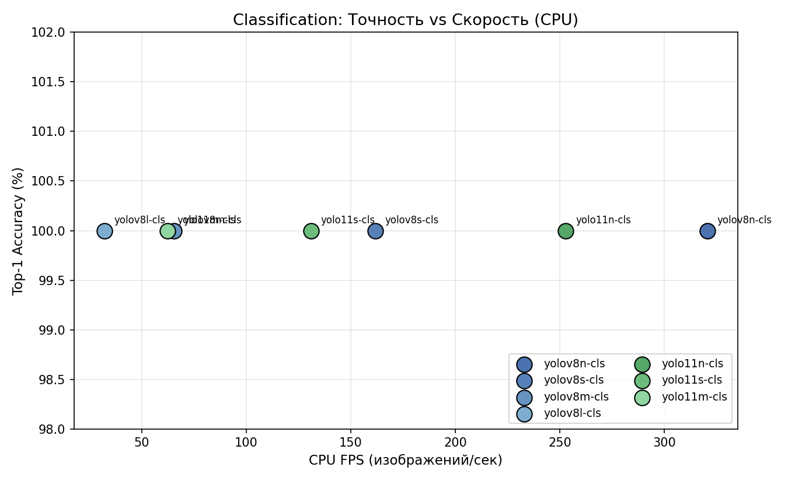
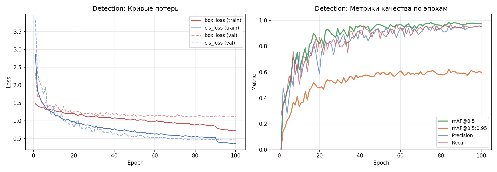

# 01. Хронология проекта и эволюция решений

## 1. Постановка и первоначальный подход

### 1.1 Задача

«Лёгкая система компьютерного зрения для контроля дефектов на конвейере».

Требования к итоговой системе:
1. Обнаружение и классификация дефектов пластиковых бутылок
2. Работа в реальном времени на обычном CPU (без GPU)
3. Возможность интеграции с производственной линией (подсчёт дефектов, лог)

### 1.2 Первоначальный подход: Classification

На первом этапе было решено использовать **classification** — полный кадр → один класс дефекта. Причины выбора:
- Простота разметки данных
- Высокие скорости инференса (cls-модели быстрее detect)
- Готовый датасет [bottle-defect-jqd6l](https://universe.roboflow.com/thesis-work-l9lqp/bottle-defect-jqd6l)

Таксономия классов на этом этапе: 4 класса (`good_bottle`, `cork_missmatch`, `label_missing`, `shape_mismatch`).

## 2. Этап 1 — Сравнительное исследование классификаторов

### 2.1 Обучение 7 моделей

Запущено сравнительное исследование — обучены 7 моделей при **одинаковых гиперпараметрах** для честного сравнения:

| Группа | Модели |
|---|---|
| YOLOv8 (2023) | yolov8n-cls, yolov8s-cls, yolov8m-cls, yolov8l-cls |
| YOLOv11 (2024) | yolo11n-cls, yolo11s-cls, yolo11m-cls |

**Единые гиперпараметры:** epochs=50 (early stopping patience=15), imgsz=224, batch=32, AdamW lr=0.001, seed=42.

### 2.2 Результаты

Все 7 моделей достигли **100% Top-1 accuracy** на test-сплите (50 изображений). Это показало, что исходный датасет был слишком простым — 4 визуально разделимых класса с чёткими признаками.

Полный отчёт и таблицы: [02_classification_comparison.md](02_classification_comparison.md)



### 2.3 Выводы и решение сменить задачу

Проблемы classification-подхода:
1. **Одна бутылка за раз** — не подходит для конвейера, где может быть несколько объектов в кадре
2. **Нет локализации** — не знаем, где именно дефект на корпусе
3. **Датасет слишком простой** — 100% у всех моделей не даёт ценного сравнения

**Принято решение:** перейти на **detection** — локализация каждого дефекта bbox-ом, что ближе к реальному production-использованию.

## 3. Этап 2 — Переход на Detection

### 3.1 Новый датасет

Подготовлен кастомный detection-датасет (Roboflow workspace `nurlastdey/nurlastdey`):
- **1161** train-изображений, **204** val-изображений
- **6 классов с bbox-разметкой**:

| ID | Класс | Описание |
|---|---|---|
| 0 | deformed_bottl | Деформация корпуса |
| 1 | misaligned_label | Перекошенная этикетка |
| 2 | missing_cap | Отсутствующая крышка |
| 3 | missing_label | Отсутствующая этикетка |
| 4 | neck_deformed | Деформация горлышка |
| 5 | normal | Бутылка без дефектов |

### 3.2 Выбор архитектуры

Учитывая результаты classification-исследования (yolov8n-cls оказался оптимальным по соотношению точность/скорость), для detection была выбрана **YOLOv8n detection** — та же архитектурная основа, но с Detection Head вместо Classification Head.

### 3.3 Обучение detection-модели

Запущено на сервере с RTX 5080 Laptop GPU:
- 100 эпох (патиенс 20 — не сработал, модель улучшалась до конца)
- imgsz 640, batch 32, AdamW lr=0.001
- Время: **~9 минут** на 100 эпох

Проблемы и их решения в ходе обучения:
- **Ошибка `libnvrtc-builtins.so.13.0`** — PyTorch не видел CUDA-библиотеки → решено через `LD_LIBRARY_PATH`
- **Placeholder классы** в первом прогоне → после обучения имена классов обновлены внутри весов через `torch.save`

Подробно: [03_detection_final.md](03_detection_final.md)

### 3.4 Результаты



| Метрика | Значение |
|---|---|
| mAP@0.5 | 0.984 |
| mAP@0.5:0.95 | 0.622 |
| Precision | 0.961 |
| Recall | 0.953 |
| CPU FPS @ imgsz=640 | 33.5 |
| Размер весов | 6.23 MB |

## 4. Этап 3 — Прикладная система

### 4.1 Выбор технологии UI

Рассмотрены варианты:
- **Gradio** (web) — быстрый прототип, но зависит от браузера
- **OpenCV cv2.imshow** — простейший вариант, но примитивный UI
- **PySide6 (Qt)** — нативное десктоп-приложение, профессиональный вид ✓

Выбрана **PySide6** — нативное приложение с тёмной темой, корректной работой в фоновом потоке (QThread) и кроссплатформенностью (macOS / Windows / Linux).

### 4.2 Три режима работы

| Режим | Использование |
|---|---|
| 📷 Фото | Анализ одной картинки |
| 🎬 Видео | Покадровая обработка видеофайла |
| 📹 Live | Детекция с веб-камеры в реальном времени |

### 4.3 Проблемы стабильности и их решения

При первом запуске на реальном видео обнаружены проблемы:
1. **Рамки на весь экран** — модель иногда выдаёт огромные bbox
2. **Моргание** — детекции пропадают на 1-2 кадрах
3. **Нестабильное обнаружение слабых классов** (missing_label) — низкая уверенность модели

Реализованы улучшения ([подробно](04_inference_system.md)):
- **ByteTrack** — трекинг объектов между кадрами
- **Area filter** — бокс > 75% или < 0.2% кадра отбрасывается
- **EMA-сглаживание координат** (α=0.8 для слабых, 0.5 для сильных)
- **Per-class conf thresholds** — слабым классам порог 0.25, сильным 0.45
- **Inertia tracking** — слабый класс удерживается до 10 кадров без новой детекции
- **MIN_HITS=2** для слабых классов — защита от одиночных ложных

## 5. Архитектура итоговой системы

```
┌──────────────────────────────────────────────────────┐
│                   app_native.py (PySide6 GUI)       │
├──────────────────────────────────────────────────────┤
│  InferenceWorker (QThread)                           │
│    ↓                                                 │
│  model.track() [YOLOv8n + ByteTrack]                │
│    ↓                                                 │
│  Filters: area → per-class conf → EMA smoothing      │
│    ↓                                                 │
│  Inertia tracking (hold weak class 10 frames)        │
│    ↓                                                 │
│  Annotate frame with bbox + labels                   │
│    ↓                                                 │
│  Emit Qt signal → UI update (non-blocking)           │
└──────────────────────────────────────────────────────┘
```

## 6. Итоговая сводка решений

| Этап | Что сделано | Зачем / Почему |
|---|---|---|
| 1 | Обучено 7 cls-моделей | Сравнительное исследование |
| 2 | Смена на detection | Reality-check: cls не решает production-задачу |
| 3 | Новый 6-классный датасет с bbox | Локализация каждого дефекта |
| 4 | YOLOv8n detection | Выбрано из результатов cls-исследования |
| 5 | Обновление имён классов в .pt | Правильные названия в весах |
| 6 | PySide6 нативное приложение | Профессиональный UI для защиты |
| 7 | ByteTrack + EMA + inertia | Стабильная детекция на live-видео |
| 8 | Per-class conf + MIN_HITS | Баланс recall/precision для слабых классов |

## Ссылки на детальные отчёты

- [02_classification_comparison.md](02_classification_comparison.md) — сравнение 7 классификаторов
- [03_detection_final.md](03_detection_final.md) — обучение финальной модели
- [04_inference_system.md](04_inference_system.md) — реализация системы
- [../results/report.md](../results/report.md) — итоговый отчёт для защиты ВКР
