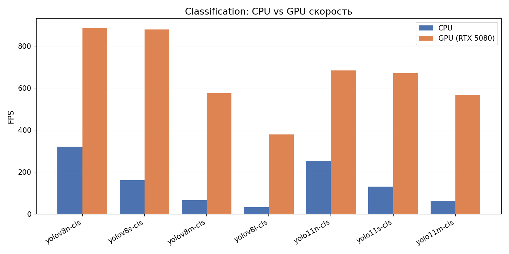
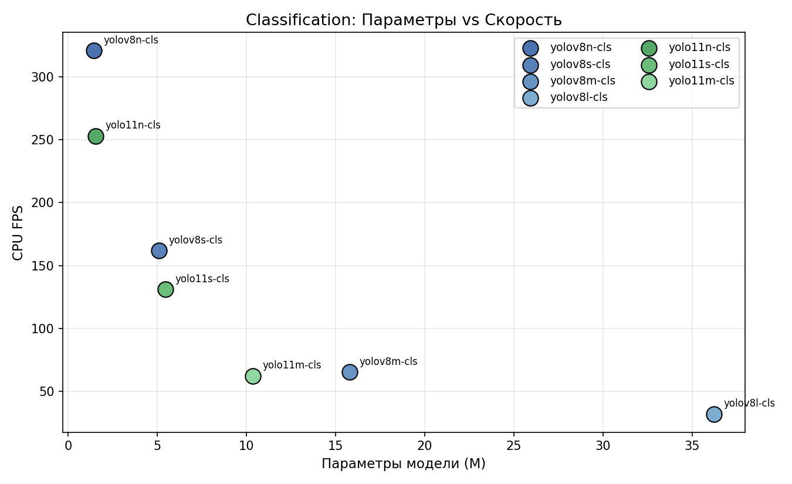
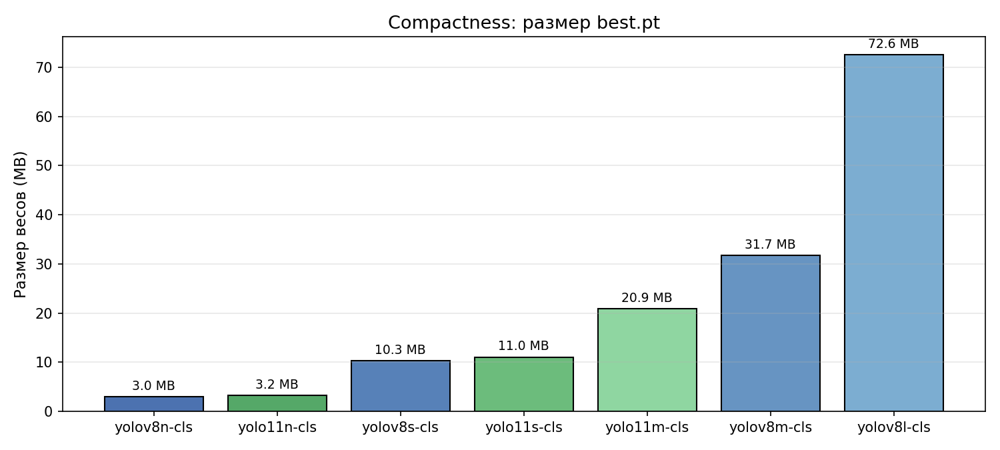
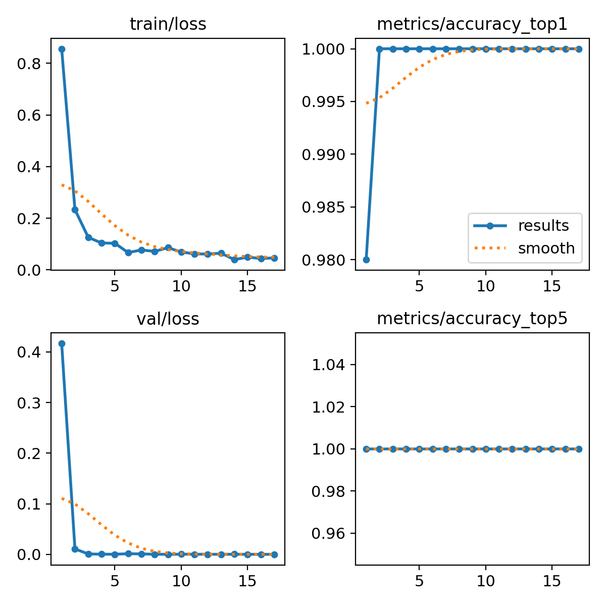
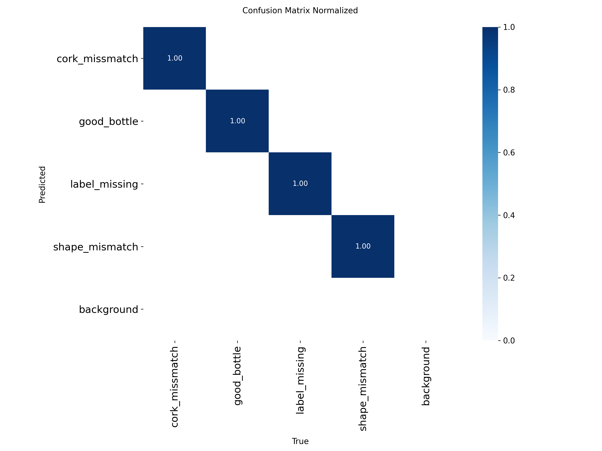

# 02. Сравнительное исследование классификаторов

> **Статус:** промежуточный этап. На основе его результатов был выбран финальный backbone (YOLOv8n) и принято решение о переходе с classification на detection.

## 1. Цель этапа

Обучить семейство YOLO-классификаторов в одинаковых условиях и определить:
1. Какая архитектура оптимальна для лёгкой системы на CPU
2. Даёт ли YOLOv11 преимущество над YOLOv8 на этой задаче
3. Какой размер модели (n/s/m/l) достаточен

## 2. Датасет

**[bottle-defect-jqd6l](https://universe.roboflow.com/thesis-work-l9lqp/bottle-defect-jqd6l)** — Roboflow Universe classification-датасет.

| Разбиение | Изображений |
|---|---|
| train | 702 |
| valid | 100 |
| test | 50 |
| **Итого** | **852** |

**Классы (4):**
- `good_bottle` — без дефектов
- `cork_missmatch` — отсутствующая/перекошенная крышка
- `label_missing` — отсутствующая этикетка
- `shape_mismatch` — деформация корпуса

## 3. Модели

Обучены 7 вариантов из двух поколений YOLO:

| Модель | Параметры | Поколение | Роль |
|---|---|---|---|
| yolov8n-cls | 1.44 M | 2023 | Ультралёгкий baseline |
| yolov8s-cls | 5.09 M | 2023 | Средний |
| yolov8m-cls | 15.78 M | 2023 | Крупный |
| yolov8l-cls | 36.21 M | 2023 | Тяжёлый |
| yolo11n-cls | 1.54 M | 2024 | Nano новой архитектуры |
| yolo11s-cls | 5.45 M | 2024 | Small новой архитектуры |
| yolo11m-cls | 10.36 M | 2024 | Medium новой архитектуры |

## 4. Единые гиперпараметры

| Параметр | Значение |
|---|---|
| epochs | 50 |
| imgsz | 224 (стандарт для cls, ImageNet-style) |
| batch | 32 |
| optimizer | AdamW |
| lr0 | 0.001 |
| patience (early stopping) | 15 |
| seed | 42 |
| device | NVIDIA RTX 5080 Laptop GPU |

## 5. Результаты — точность

**Все 7 моделей сошлись к 100% Top-1 accuracy на test-сплите.**

Причины:
1. Маленький test-сплит (50 изображений)
2. Визуальное разделение классов простое
3. ImageNet-pretrained backbone легко справляется с 4 классами

Это — **ключевой вывод**: задача на данном датасете слишком простая, accuracy **не является** дискриминирующим фактором. Сравнивать модели нужно по **скорости и размеру**.

## 6. Результаты — скорость

### 6.1 CPU (Apple Silicon)

| Модель | CPU FPS | Latency (мс) |
|---|---|---|
| **yolov8n-cls** | **320.7** | **3.12** |
| yolo11n-cls | 252.9 | 3.95 |
| yolov8s-cls | 161.7 | 6.19 |
| yolo11s-cls | 131.0 | 7.64 |
| yolov8m-cls | 65.4 | 15.29 |
| yolo11m-cls | 62.3 | 16.05 |
| yolov8l-cls | 32.0 | 31.28 |

### 6.2 CPU vs GPU

На GPU разница между моделями сокращается: разница n vs s всего 3%, между семействами — 15-20%. На CPU разрыв в разы (n в 10× быстрее l).

### 6.3 Параметры vs скорость

Обратная пропорциональность: чем больше параметров — тем ниже FPS. YOLOv11 незначительно медленнее YOLOv8 на тех же параметрах (C3k2 блоки дороже чем C2f).

## 7. Результаты — компактность

| Модель | Размер (MB) |
|---|---|
| yolov8n-cls | 2.97 |
| yolo11n-cls | 3.19 |
| yolov8s-cls | 10.26 |
| yolo11s-cls | 11.03 |
| yolo11m-cls | 20.88 |
| yolov8m-cls | 31.69 |
| yolov8l-cls | 72.59 |

## 8. Сводная таблица

Все метрики: [classification_benchmarks.csv](classification_benchmarks.csv)

| model | params_M | size_MB | cpu_fps | gpu_fps | top1 |
|---|---|---|---|---|---|
| **yolov8n-cls** | **1.44** | **2.97** | **320.7** | 885.1 | **1.000** |
| yolov11n-cls | 1.54 | 3.19 | 252.9 | 683.8 | 1.000 |
| yolov8s-cls | 5.09 | 10.26 | 161.7 | 878.5 | 1.000 |
| yolov11s-cls | 5.45 | 11.03 | 131.0 | 669.7 | 1.000 |
| yolov11m-cls | 10.36 | 20.88 | 62.3 | 566.9 | 1.000 |
| yolov8m-cls | 15.78 | 31.69 | 65.4 | 575.3 | 1.000 |
| yolov8l-cls | 36.21 | 72.59 | 32.0 | 377.9 | 1.000 |

## 9. Артефакты обучения по каждой модели

Графики, confusion matrix, batch-сэмплы — в [figures/classification/](figures/classification/):

Для каждой из 7 моделей доступны:
- `args.yaml` — точные гиперпараметры обучения
- `results.csv` / `results.png` — кривые loss и accuracy по эпохам
- `confusion_matrix.png` / `confusion_matrix_normalized.png`
- `train_batch0.jpg`, `train_batch1.jpg`, `train_batch2.jpg` — визуализация train-батчей
- `val_batch0_labels.jpg` / `val_batch0_pred.jpg` — сравнение GT vs предсказания

Пример для yolov8n-cls:

## 10. Лог обучения

Полный лог: [logs/train_all.log](logs/train_all.log) (обучение yolov8n/s + yolo11n/s), [logs/train_extra.log](logs/train_extra.log) (yolov8m/l + yolo11m).

Время обучения всех 7 моделей: **менее 10 минут суммарно** на RTX 5080. Модели сходились за 1-2 эпохи и останавливались early stopping на 15-17 эпохе.

## 11. Выводы и переход к detection

### 11.1 Выводы по сравнению

1. **Accuracy не дискриминирует** на этом датасете — все модели 100%
2. **YOLOv8n-cls — оптимальный выбор** по совокупности:
   - 320 FPS на CPU (лучший в классе)
   - 2.97 MB (минимум)
   - 1.44M параметров (минимум)
3. **YOLOv11 не даёт преимуществ** на задаче с малым количеством классов и чёткими признаками
4. **Large-варианты излишни** — в 10× медленнее при той же точности

### 11.2 Ограничения classification-подхода

| Ограничение | Последствие |
|---|---|
| Один объект на кадре | Не работает с несколькими бутылками |
| Нет локализации | Непонятно, где именно дефект |
| Переобучение на лёгком датасете | 100% метрика — нет потолка для развития |

### 11.3 Решение

На основе выводов **переход на detection** — локализация каждого дефекта bbox-ом. Backbone YOLOv8n сохраняется (как победитель cls-исследования), но с Detection Head.

См. [03_detection_final.md](03_detection_final.md).
