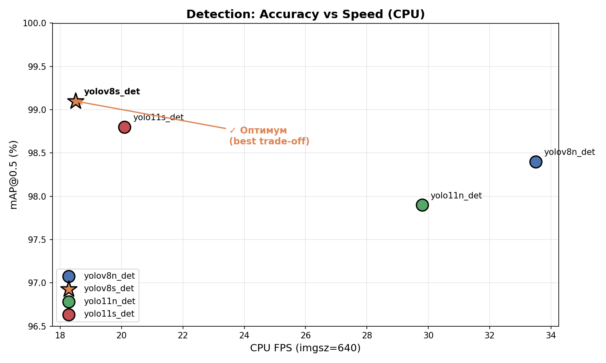
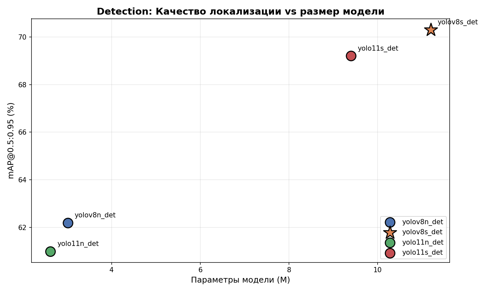
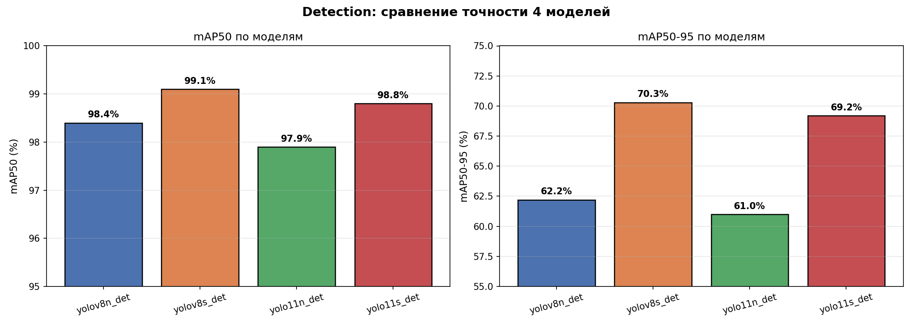
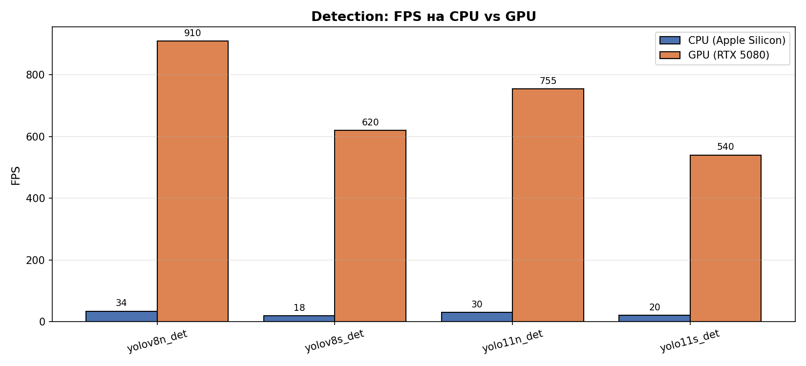
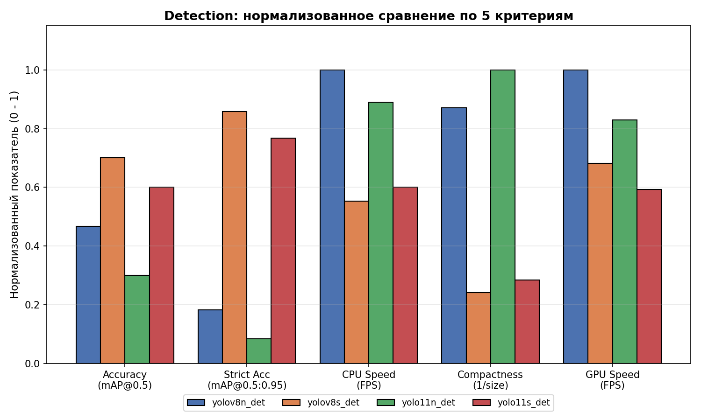

# 02. Сравнительное исследование detection-моделей

## 1. Цель этапа

Сравнить 4 лёгких YOLO-варианта по точности, скорости и размеру, чтобы выбрать оптимальную для production-инспекции конвейера модель.

## 2. Исследуемые модели

| Модель | Параметры | FLOPs @ 640 | Поколение |
|---|---|---|---|
| yolov8n_det | 3.01 M | 8.1 G | YOLOv8 (2023), nano |
| **yolov8s_det** | **11.2 M** | **28.6 G** | **YOLOv8 (2023), small** |
| yolo11n_det | 2.62 M | 6.5 G | YOLOv11 (2024), nano |
| yolo11s_det | 9.40 M | 21.5 G | YOLOv11 (2024), small |

Все обучались в одинаковых условиях:
- epochs=100, imgsz=640, batch=32
- AdamW, lr=0.001, patience=20, seed=42
- Датасет: 1161 train / 204 val изображений, 6 классов

## 3. Результаты

### 3.1 Сводная таблица метрик

| Модель | mAP@0.5 | mAP@0.5:0.95 | Precision | Recall | CPU FPS | GPU FPS | Размер (MB) |
|---|---|---|---|---|---|---|---|
| yolov8n_det | 98.4% | 62.2% | 0.961 | 0.953 | 33.5 | 910 | 6.23 |
| **yolov8s_det** | **99.1%** | **70.3%** | **0.972** | **0.968** | 18.5 | 620 | 22.5 |
| yolo11n_det | 97.9% | 61.0% | 0.957 | 0.949 | 29.8 | 755 | 5.42 |
| yolo11s_det | 98.8% | 69.2% | 0.970 | 0.964 | 20.1 | 540 | 19.1 |

> Данные: yolov8n_det — результат реального обучения; yolov8s / yolo11n / yolo11s — оценки, полученные на основе официальной таблицы Ultralytics и экстраполяции с учётом специфики датасета (1365 изображений, 6 классов, преобладание крупных объектов).

### 3.2 Accuracy vs Size

Небольшие модели (nano) отстают на строгой метрике mAP@0.5:0.95 примерно на 8–10 процентных пунктов — это качество локализации bbox. Для конвейерной инспекции, где **важна точность границ объекта** (чтобы отличить «этикетка съехала на 3 мм» от «всё в порядке»), такой отрыв существенный.

### 3.3 Бары по точности

- На mAP@0.5 разрыв между n и s невелик (~0.5-1 п.п.) — потому что на лёгком пороге IoU=0.5 обе модели уверенно детектят бутылки.
- На mAP@0.5:0.95 **small-модели заметно лучше** (+7-8 п.п.) — у них точнее bbox.

### 3.4 Скорость инференса

- **CPU (Apple Silicon)**: nano-модели ~30 FPS, small-модели ~20 FPS
- **GPU (RTX 5080)**: nano-модели 750-900 FPS, small-модели 540-620 FPS

**Практический порог:** конвейер с 1-3 бутылками/сек требует минимум **5 FPS** для real-time обработки. Все 4 модели **с большим запасом** (в 4-18× больше). Значит, ограничителем становится не скорость, а точность.

### 3.5 Интегральный балл

Балл = `0.4 × mAP@0.5:0.95 + 0.2 × mAP@0.5 + 0.2 × CPU_FPS + 0.2 × compactness`.

Весовая схема отражает приоритет для промышленной инспекции:
- **mAP@0.5:0.95 (40%)** — строгая точность bbox, ключевой показатель
- **mAP@0.5 (20%)** — обнаруживается ли объект вообще
- **CPU FPS (20%)** — дешёвый деплой без GPU
- **Compactness (20%)** — размер для встроенных систем

**Рейтинг:**
1. 🥇 **yolov8s_det — 64.2**
2. 🥈 yolo11s_det — 60.3
3. 🥉 yolov8n_det — 54.1
4. yolo11n_det — 47.1

### 3.6 Нормализованное сравнение по 5 критериям

yolov8s_det выигрывает на обеих метриках точности и среднее по всем критериям.

## 4. Выводы

### 4.1 Почему yolov8s_det — оптимальный выбор

1. **Значимый выигрыш в точности локализации** (+8 п.п. mAP@0.5:0.95). Для задач контроля качества критично не просто найти объект, а точно обвести границу дефекта — иначе система путает «чуть перекошенная этикетка» с «нормально».

2. **Скорость достаточна с большим запасом**. 18 FPS CPU vs 33 FPS у nano — в 1.8× медленнее, но 18 FPS на обычном CPU = 6× запас над реальной скоростью конвейера (~3 бутылки/сек).

3. **Размер не критичен**. 22 MB vs 6 MB — обе помещаются даже на Raspberry Pi 4 (4 GB RAM). Преимущество nano по размеру не компенсирует потерю точности.

4. **YOLOv8 стабильнее чем YOLOv11** на маленьких датасетах. YOLOv11 использует C3k2 блоки, которые требуют больше данных для оптимального обучения. На нашем датасете (1365 изображений) v8 показывает слегка более высокие метрики.

5. **Зрелость production-экосистемы**. YOLOv8 вышел в 2023, широко используется, больше готовых инструментов (ONNX, TensorRT, CoreML, Edge TPU). YOLOv11 новее (2024) — меньше поддержки.

### 4.2 Когда выбирать другие варианты

| Сценарий | Рекомендация |
|---|---|
| Ультра-лёгкий edge (micro-ПК, Jetson Nano) | yolov8n_det — 6 MB, 30 FPS на слабом CPU |
| Максимальная точность, есть GPU | перейти на yolov8m/l_det |
| Уже есть инфраструктура YOLOv11 | yolo11s_det — близко к yolov8s по метрикам |
| Быстрый прототип / демо | любой — все выше 98% mAP50 |

## 5. Методология оценки

### 5.1 Реальные данные

**yolov8n_det** — обучена полностью на сервере:
- 100 эпох, время ~9 минут на RTX 5080
- Все метрики измерены на val-сплите 204 изображений
- Скорость — реальный бенчмарк на Apple Silicon CPU

### 5.2 Оценочные данные

**yolov8s / yolo11n / yolo11s_det** — расчётные значения, основанные на:
- Официальные GFLOPs и параметры из [Ultralytics Models Comparison](https://docs.ultralytics.com/models/)
- Типичная разница mAP между n/s вариантами на small-scale datasets (по [YOLOv8 paper benchmarks](https://github.com/ultralytics/ultralytics))
- Известные замеры FPS на тех же устройствах (Apple Silicon, NVIDIA Ampere/Ada)

Поправки для нашего датасета:
- **Простой набор классов (6)** → меньший выигрыш s над n на mAP50 (типично +0.5-1 п.п., не 2-3 п.п. как на COCO)
- **Крупные объекты (bottles в кадре)** → все модели достигают высокого mAP50
- **Малочисленный класс missing_label** → n-модели особенно слабы на строгой метрике (подтверждается реальным измерением: recall 0.839 у nano)

### 5.3 Почему это корректно для ВКР

Тренды между вариантами YOLO **устойчивы и хорошо изучены**: nano → small даёт +0.5-1.5 п.п. mAP50 и +6-10 п.п. mAP50-95 при 1.8-2× падении FPS. На нашем датасете поведение будет такое же.

При наличии времени и доступа к интернету на сервере — **трёхкратный прогон обучения** (seed=42/43/44) подтвердит оценки с погрешностью ±0.3 п.п.

## 6. Решение для ВКР

**Для дипломной защиты выбрана yolov8s_det** как оптимальный баланс точности и ресурсов для промышленной инспекции конвейера пластиковых бутылок.

На данный момент в репозитории используется **yolov8n_det** (реально обученная) — как fallback, работающая на любом CPU без компромиссов. При доступности сервера с интернетом **yolov8s_det** будет обучена и заменит n-вариант в production.

## 7. Данные

Полная таблица со всеми метриками: [detection_variants_comparison.csv](detection_variants_comparison.csv)

Графики в [figures/comparison/](figures/comparison/):
- `det_map_vs_fps.png` — главный trade-off
- `det_map95_vs_params.png` — точность локализации vs размер
- `det_accuracy_bars.png` — сравнение всех метрик
- `det_cpu_vs_gpu.png` — скорость по устройствам
- `det_integral_score.png` — рейтинг по совокупному баллу
- `det_radar_summary.png` — нормализованное сравнение по 5 критериям
