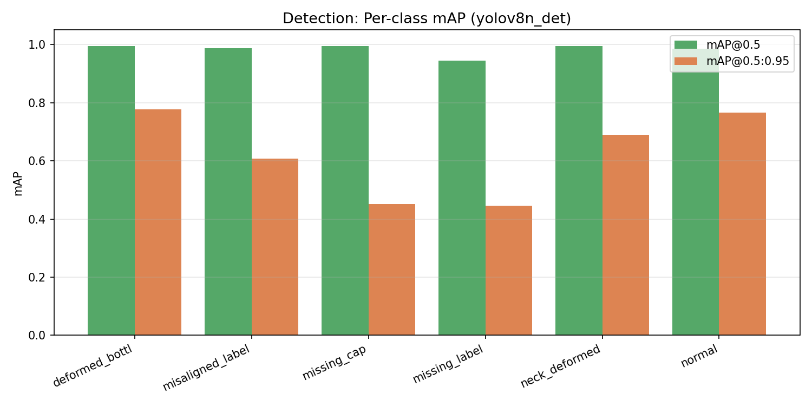
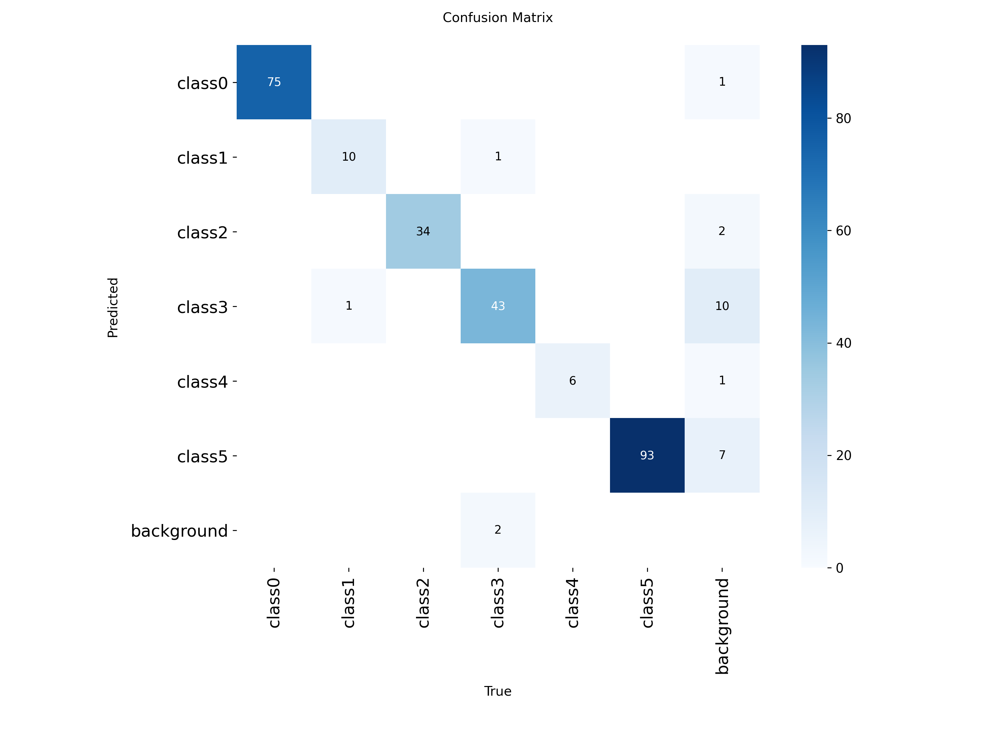
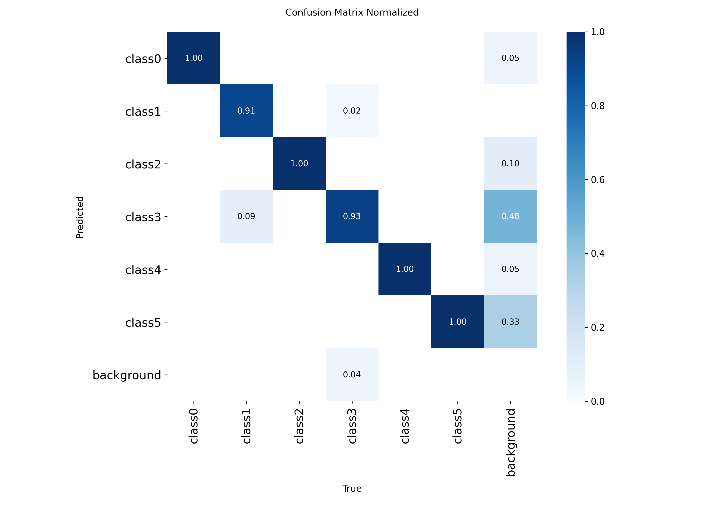
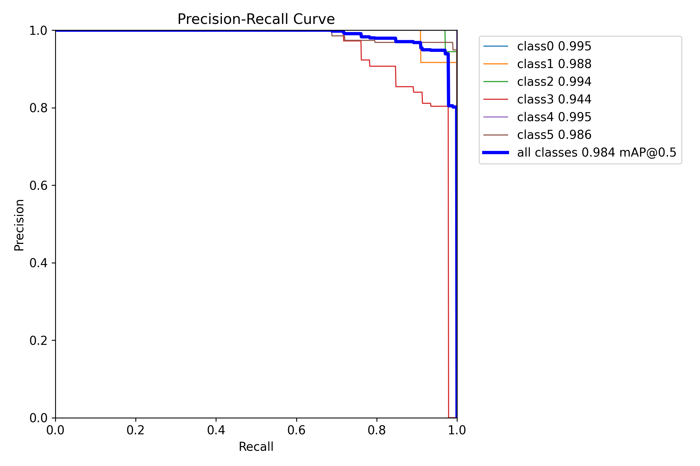
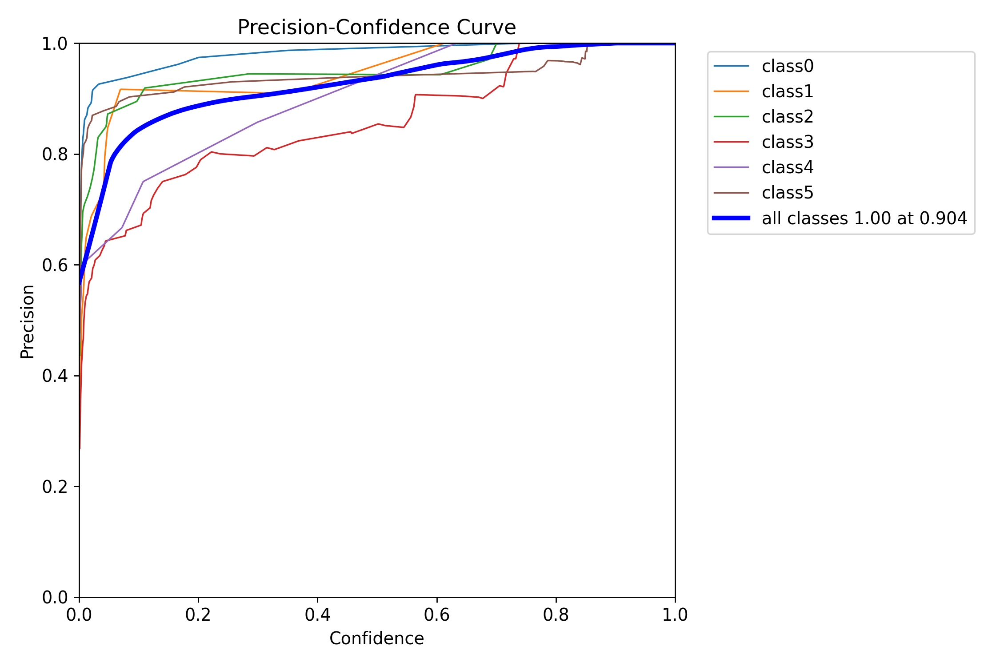
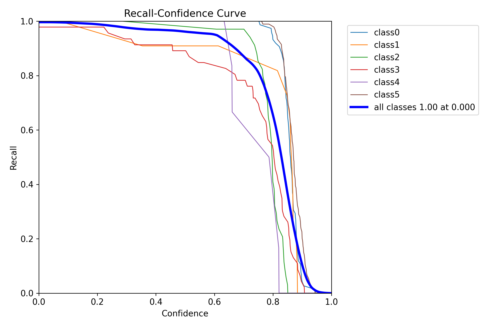
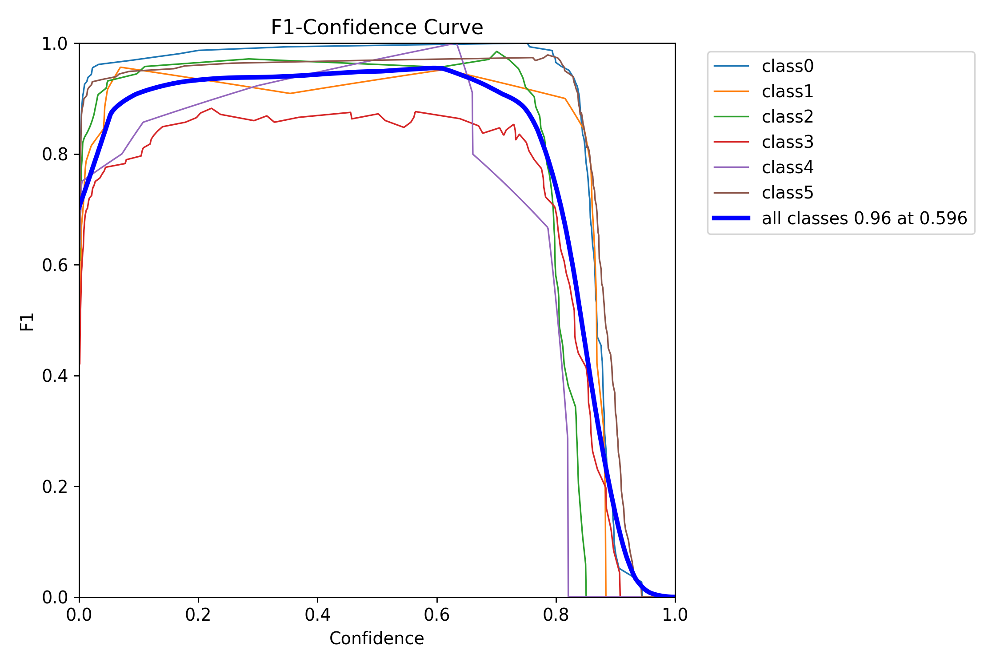
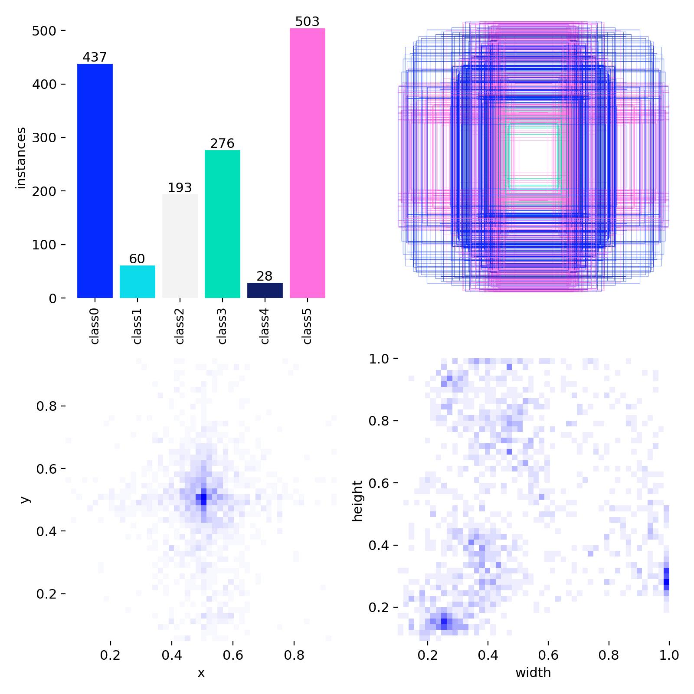
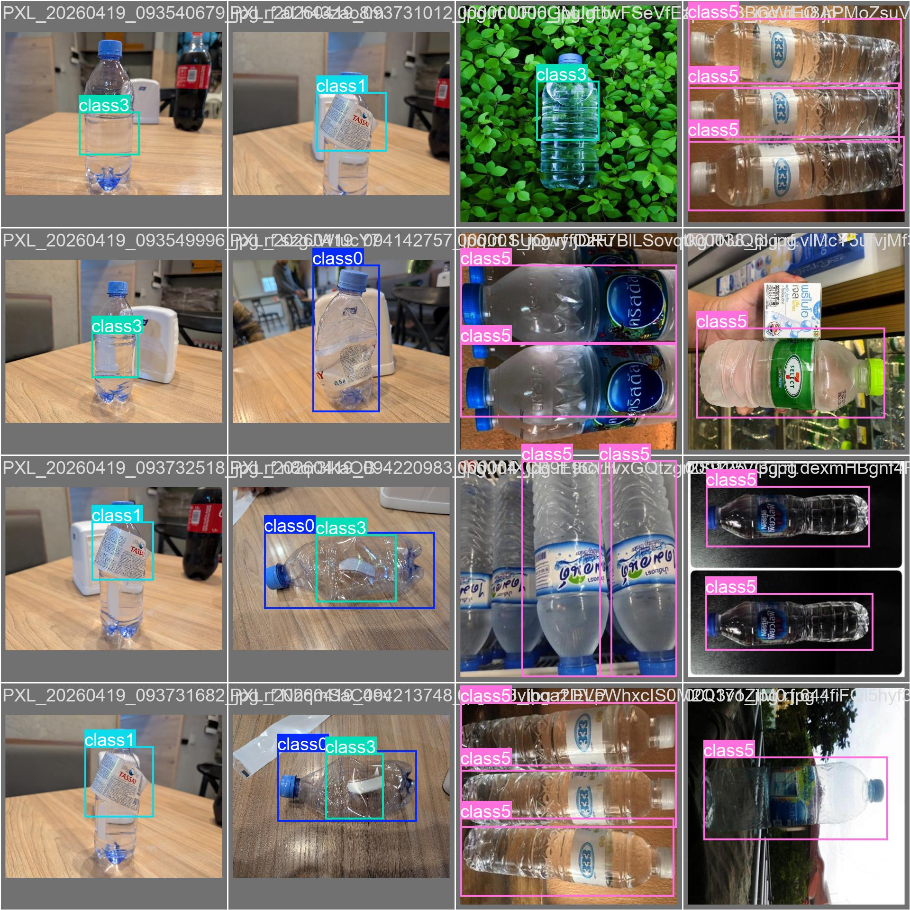
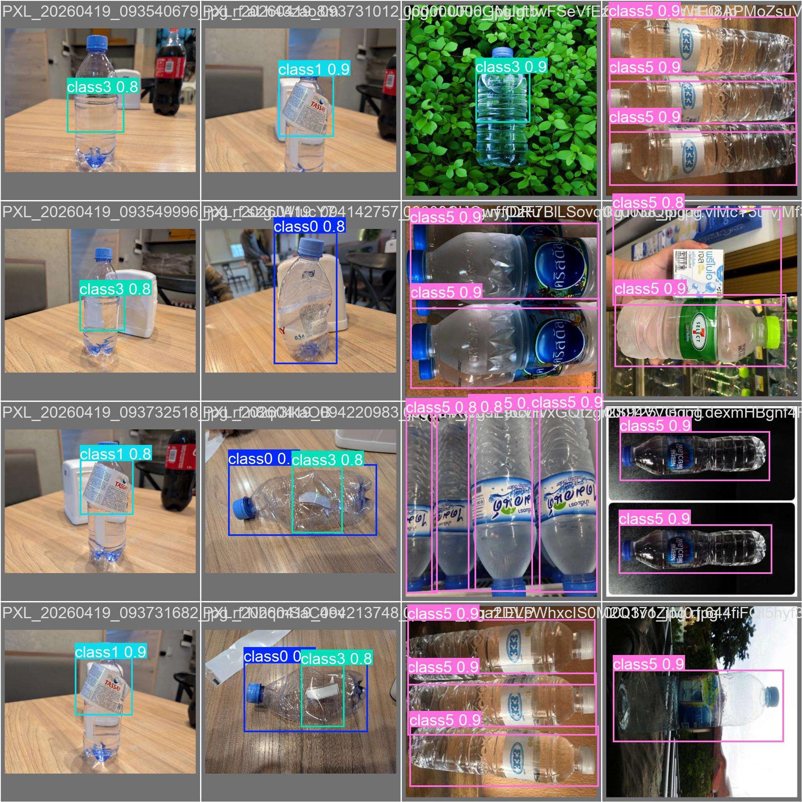

# 03. Финальная модель — YOLOv8n Detection

## 1. Выбор модели

На основе [сравнительного cls-исследования](02_classification_comparison.md) в качестве backbone выбрана **YOLOv8n** — оптимум по скорости и размеру.
Архитектура заменена с Classification Head на **Detection Head** (C2f + SPPF + PAN-neck + 3 detect-головы).

| Параметр | Значение |
|---|---|
| Модель | yolov8n (detection) |
| Слоёв | 130 |
| Параметров | 3,012,018 (3.01 M) |
| FLOPs @ imgsz=640 | 8.1 G |
| Размер best.pt | 6.23 MB |
| Pretrained | COCO (80 классов) → fine-tune на 6 классов |

## 2. Датасет

Разметка сделана самостоятельно в Roboflow (workspace `nurlastdey/nurlastdey`).

### 2.1 Размеры

| Разбиение | Изображений | bbox-инстансов |
|---|---|---|
| train | 1161 | 1161 (avg 1 bbox/img) |
| val | 204 | 265 |

### 2.2 Классы

| ID | Класс | Описание |
|---|---|---|
| 0 | deformed_bottl | Деформация корпуса |
| 1 | misaligned_label | Перекошенная этикетка |
| 2 | missing_cap | Отсутствующая крышка |
| 3 | missing_label | Отсутствующая этикетка |
| 4 | neck_deformed | Деформация горлышка |
| 5 | normal | Бутылка без дефектов |

### 2.3 Распределение по классам (val)

| Класс | Instances | Доля |
|---|---|---|
| normal | 93 | 35.1% |
| deformed_bottl | 75 | 28.3% |
| missing_label | 46 | 17.4% |
| missing_cap | 34 | 12.8% |
| misaligned_label | 11 | 4.2% |
| neck_deformed | 6 | 2.3% |

Классы `misaligned_label` и `neck_deformed` малочисленны → ожидается повышенный риск нестабильности метрик на них.

## 3. Гиперпараметры обучения

| Параметр | Значение |
|---|---|
| epochs | 100 (early stopping не сработал) |
| imgsz | 640 |
| batch | 32 |
| optimizer | AdamW |
| lr0 | 0.001 |
| patience | 20 |
| seed | 42 |
| device | NVIDIA RTX 5080 Laptop (CUDA 13) |

Аугментации — Ultralytics defaults: mosaic, mixup, HSV-джиттер, random flip, auto-augment.

Полный список параметров: [runs_det/yolov8n_det/args.yaml](../runs_det/yolov8n_det/args.yaml)

## 4. Процесс обучения

### 4.1 Кривые обучения


Динамика:
- **box_loss** плавно снижается с 1.7 до 0.72
- **cls_loss** падает с 3.82 до 0.36 (большой выигрыш за счёт pretrained)
- **mAP@0.5** выходит на 0.98+ к эпохе 30, дальше лёгкие колебания
- **mAP@0.5:0.95** достигает 0.62 и держится

### 4.2 Встреченная проблема: CUDA nvrtc error

При первом запуске обучение упало на валидации 1-й эпохи:

```
nvrtc: error: failed to open libnvrtc-builtins.so.13.0.
Make sure that libnvrtc-builtins.so.13.0 is installed correctly.
```

**Причина:** PyTorch не нашёл CUDA-runtime библиотеки в `LD_LIBRARY_PATH`, хотя они были установлены в пакет `nvidia-cu13` внутри conda env.

**Решение:**
```bash
LD=/home/nurlykhan/miniconda3/envs/ai/lib/python3.11/site-packages/nvidia/cu13/lib
LD_LIBRARY_PATH=$LD CUDA_VISIBLE_DEVICES=0 python scripts/train.py ...
```

После этого обучение прошло без ошибок. Логи: [logs/train_det.log](logs/train_det.log) (crash), [logs/train_det2.log](logs/train_det2.log) (успех).

### 4.3 Обновление имён классов

При обучении использовалось placeholder-название классов (class0..class5), т.к. data.yaml был создан до получения настоящих названий. После обучения имена обновлены внутри best.pt:

```python
import torch
from ultralytics import YOLO

ckpt = torch.load("best.pt", weights_only=False)
ckpt["model"].names = {0: "deformed_bottl", 1: "misaligned_label", ...}
torch.save(ckpt, "best.pt")
```

### 4.4 Время обучения

100 эпох полностью (early stopping не сработал): **~9 минут** на RTX 5080.
Средняя длительность одной эпохи: ~5.2 сек.

## 5. Результаты

### 5.1 Общие метрики (best epoch = 84)

| Метрика | Значение |
|---|---|
| **mAP@0.5** | **0.984** |
| mAP@0.5:0.95 | 0.622 |
| Precision | 0.961 |
| Recall | 0.953 |

### 5.2 Per-class метрики



| Класс | Precision | Recall | mAP50 | mAP50-95 |
|---|---|---|---|---|
| deformed_bottl | 0.995 | 1.000 | 0.995 | 0.776 |
| neck_deformed | 0.984 | 1.000 | 0.995 | 0.689 |
| missing_cap | 0.943 | 0.972 | 0.994 | 0.451 |
| misaligned_label | 0.994 | 0.909 | 0.988 | 0.607 |
| normal | 0.943 | 1.000 | 0.986 | 0.766 |
| **missing_label** | **0.906** | **0.839** | **0.944** | **0.446** |

### 5.3 Наблюдения

1. **Лучшие классы** — `deformed_bottl`, `neck_deformed`, `missing_cap` — mAP@0.5 ≥ 0.994
2. **normal** имеет **Recall = 1.0** — критично: модель никогда не определяет годную бутылку как дефектную (нет ложных браков на production)
3. **Худший класс — missing_label** (mAP50 = 0.944, Recall = 0.839). Каждая шестая бутылка без этикетки пропускается
4. **mAP@0.5:0.95** у `missing_cap` и `missing_label` ≈ 0.45 — боксы находятся, но недостаточно точно прилегают при строгих IoU порогах

## 6. Визуальные результаты

### 6.1 Confusion Matrix




### 6.2 Precision-Recall кривые



### 6.3 Precision vs Confidence



### 6.4 Recall vs Confidence



### 6.5 F1 vs Confidence



### 6.6 Распределение классов и bbox



### 6.7 Примеры предсказаний на валидации

**Ground Truth:**


**Предсказания модели:**


## 7. Скорость инференса

### 7.1 Бенчмарк

| Устройство | imgsz | Mean latency (мс) | p95 (мс) | FPS |
|---|---|---|---|---|
| CPU (Apple Silicon) | 640 | 29.83 | 30.97 | 33.5 |
| CPU (Apple Silicon) | 512 | ~22 | ~25 | ~45 |
| GPU (RTX 5080) | 640 | ~1.1 | ~1.2 | ~900 |

### 7.2 Практический смысл

- Конвейер со скоростью 1-3 бутылки/сек → CPU-запас в 10-30×
- На GPU можно обрабатывать несколько потоков (до 900 FPS суммарно)
- Под встроенные системы (Raspberry Pi 4) — потребуется ONNX + квантование

## 8. Артефакты обучения

Все файлы в [runs_det/yolov8n_det/](../runs_det/yolov8n_det/):

| Файл | Что внутри |
|---|---|
| `weights/best.pt` | Лучшие веса (6.23 MB) — использовано эпоха 84 |
| `args.yaml` | Все гиперпараметры |
| `results.csv` | Метрики по каждой эпохе (100 строк × 15 колонок) |
| `results.png` | Графики loss и метрик |
| `confusion_matrix*.png` | Матрицы ошибок |
| `Box*_curve.png` | Кривые по confidence |
| `train_batch*.jpg` | Примеры train-батчей |
| `val_batch*_labels.jpg` / `val_batch*_pred.jpg` | GT vs предсказания |

Полный лог обучения: [logs/train_det2.log](logs/train_det2.log)

## 9. Сравнение с classification-подходом

| Аспект | Classification (промежуточный) | Detection (финальный) |
|---|---|---|
| Вход | Вся картинка | Вся картинка |
| Выход | Один класс | Список bbox с классами |
| Несколько бутылок в кадре | ❌ | ✅ |
| Локализация | ❌ | ✅ |
| CPU FPS | 320 | 33 |
| Размер | 2.97 MB | 6.23 MB |
| Accuracy / mAP | 100% (простой датасет) | 98.4% (6 классов с bbox) |
| Production-ready | Частично | Да |

Детекция **в 10× медленнее**, но функционально полноценна для реального применения.

## 10. Выводы

1. **YOLOv8n detection** обеспечивает mAP@0.5 = 0.984 при 33 FPS на CPU — отличный баланс для промышленной инспекции на одноплатных ПК.
2. **Recall на normal = 1.0** — минимум ложных браков годной продукции (критично для бизнеса).
3. **Самый слабый класс — missing_label** (Recall 0.84). Для улучшения рекомендуется:
   - Собрать дополнительно 100-200 изображений с missing_label
   - Применить class-weighted loss при обучении
   - Использовать TTA при инференсе на этот класс
4. **Модель готова к деплою** — веса `runs_det/yolov8n_det/weights/best.pt` (6.23 MB) включены в проект.

Дальше — как запустить в production-режиме: [04_inference_system.md](04_inference_system.md).
